# Kubernetes 3-Tier Application Deployment Overview

## Quick Architecture Summary

```mermaid
graph TB
    subgraph "User Access"
        User["👤 User"]
        Browser["🌐 Browser<br/>https://myapp.blog.com"]
    end
    
    subgraph "Infrastructure (VMware)"
        Master["🖥️ Master Node<br/>192.168.14.50"]
        Worker1["🖥️ Worker1<br/>192.168.14.54"]
        Worker2["🖥️ Worker2<br/>192.168.14.55"]
    end
    
    subgraph "Kubernetes Cluster"
        subgraph "Load Balancer"
            MetalLB["⚖️ MetalLB<br/>192.168.14.240"]
        end
        
        subgraph "Ingress"
            Nginx["🔀 NGINX Ingress<br/>TLS Termination"]
        end
        
        subgraph "Application Tier"
            Frontend["🎨 React Frontend<br/>:80"]
            Backend1["🔧 User Service<br/>:3000"]
            Backend2["📝 Blog Service<br/>:3001"]
        end
        
        subgraph "Data Tier"
            Database["🗄️ PostgreSQL<br/>:5432"]
            Storage["💾 Persistent Volume<br/>5Gi"]
        end
    end
    
    subgraph "Deployment Management"
        Helm["📦 Helm Chart"]
        GitHub["📚 GitHub Pages<br/>Chart Repository"]
    end
    
    User --> Browser
    Browser --> MetalLB
    MetalLB --> Nginx
    Nginx --> Frontend
    Nginx --> Backend1
    Nginx --> Backend2
    Backend1 --> Database
    Backend2 --> Database
    Database --> Storage
    
    Helm --> Frontend
    Helm --> Backend1
    Helm --> Backend2
    Helm --> Database
    GitHub --> Helm
    
    style User fill:#e8f5e8
    style MetalLB fill:#fff3e0
    style Nginx fill:#e3f2fd
    style Frontend fill:#f3e5f5
    style Backend1 fill:#e8f5e8
    style Backend2 fill:#e8f5e8
    style Database fill:#fff8e1
    style Helm fill:#fce4ec
```



## Deployment Process Flow

```mermaid
flowchart TD
    A["🚀 Start"] --> B["📦 Setup VMware VMs<br/>Vagrant + CentOS 9"]
    B --> C["⚙️ Install Kubernetes<br/>kubeadm + containerd"]
    C --> D["🌐 Setup Networking<br/>Cilium CNI"]
    D --> E["⚖️ Deploy MetalLB<br/>LoadBalancer"]
    E --> F["🔀 Install NGINX Ingress<br/>Controller"]
    F --> G["📦 Create Helm Chart<br/>3-tier application"]
    G --> H["🔒 Generate TLS Certificate<br/>Self-signed"]
    H --> I["🚀 Deploy Application<br/>helm install"]
    I --> J["🌍 Configure DNS<br/>/etc/hosts"]
    J --> K["✅ Access Application<br/>https://myapp.blog.com"]
    K --> L["📚 Publish to GitHub Pages<br/>Helm Repository"]
    
    style A fill:#e8f5e8
    style K fill:#e8f5e8
    style L fill:#f3e5f5
```



## Component Breakdown

### 🏗️ Infrastructure Layer
- **VMware VMs**: 3 nodes (1 master + 2 workers)
- **Operating System**: CentOS 9 Stream
- **Container Runtime**: containerd
- **Orchestration**: Kubernetes 1.32

### 🌐 Network Layer  
- **CNI**: Cilium for pod networking
- **Load Balancer**: MetalLB (192.168.14.240-250)
- **Ingress**: NGINX Ingress Controller
- **DNS**: Local /etc/hosts entry

### 🏢 Application Layer
- **Frontend**: React app (shrijanab/blog-frontend:latest)
- **Backend1**: User management (shrijanab/blog-backend1:latest) 
- **Backend2**: Blog/Comments (shrijanab/blog-backend2:latest)
- **Database**: PostgreSQL 15 StatefulSet

### 🔐 Security Layer
- **TLS**: Self-signed certificate for HTTPS
- **Secrets**: Kubernetes secrets for API keys
- **Authentication**: Clerk integration

### 📦 Deployment Layer
- **Package Manager**: Helm 3
- **Repository**: GitHub Pages hosting
- **Automation**: Helm charts with templates

## Key URLs and Access Points

| Component | URL/Address | Purpose |
|-----------|-------------|---------|
| Application | https://myapp.blog.com | Main application access |
| MetalLB IP | 192.168.14.240 | Load balancer external IP |
| Helm Repo | https://shrijanabudhathoki.github.io/three-tier-blog-app/ | Chart repository |
| GitHub | https://github.com/shrijanabudhathoki/three-tier-blog-app | Source code |

## Quick Commands Reference

### Cluster Management
```bash
# Check cluster status
kubectl get nodes
kubectl get pods -A

# Check ingress
kubectl get ingress
kubectl get svc -n ingress-nginx
```

### Application Management  
```bash
# Deploy application
helm install myapp ./three-tier-blog-app

# Update application
helm upgrade myapp ./three-tier-blog-app

# Check application status
kubectl get pods
kubectl get svc
```

### Repository Management
```bash
# Add Helm repository
helm repo add myapp https://shrijanabudhathoki.github.io/three-tier-blog-app/

# Install from repository
helm install myapp myapp/three-tier-blog-app
```

## Architecture Benefits

✅ **Scalability**: Kubernetes-native scaling  
✅ **High Availability**: Multi-node cluster  
✅ **Security**: HTTPS with certificate management  
✅ **Persistence**: StatefulSet for database  
✅ **Package Management**: Helm for easy deployment  
✅ **Repository Hosting**: GitHub Pages for distribution  
✅ **Load Balancing**: MetalLB for external access  
✅ **Service Discovery**: Native Kubernetes networking