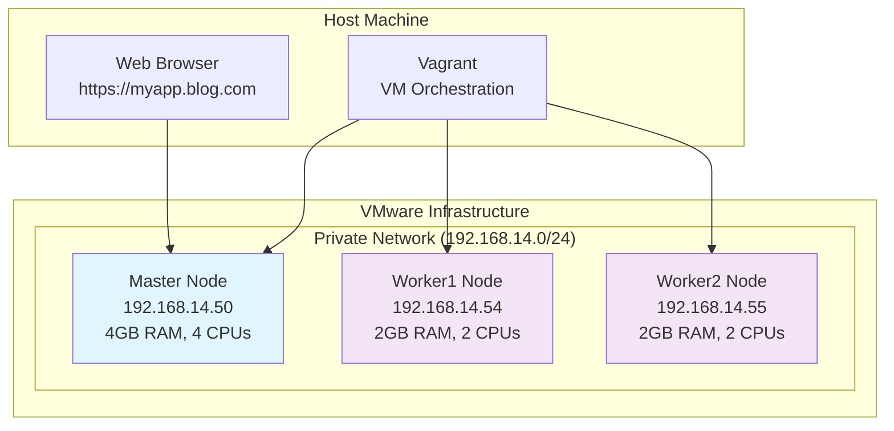
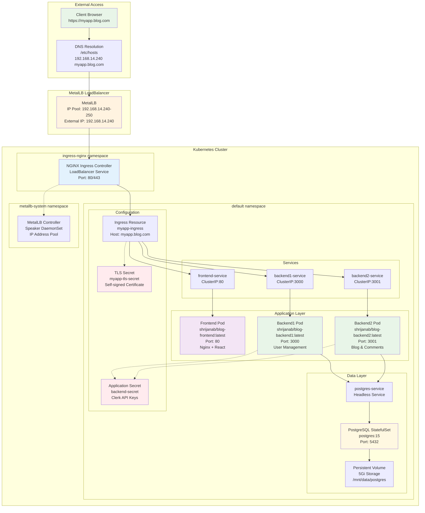
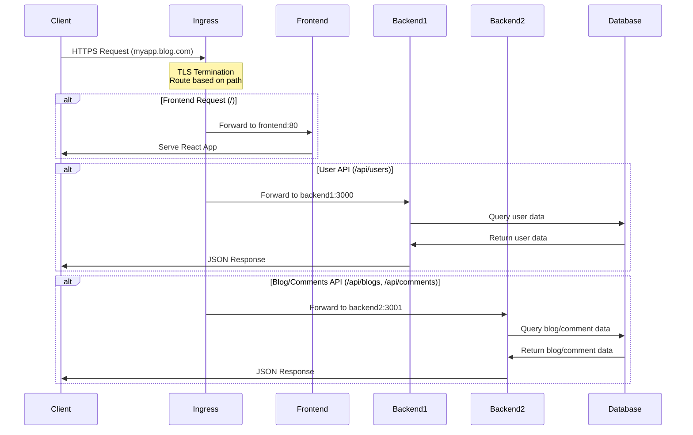
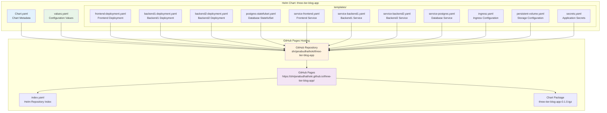
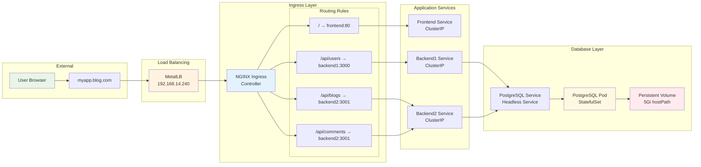
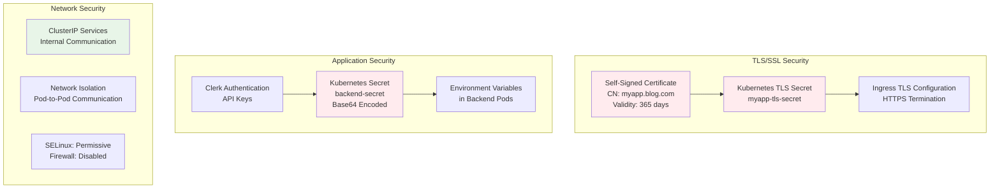

# Kubernetes 3-Tier Blog Application Architecture

## Overview
This document describes the architecture of a 3-tier blog application deployed on a Kubernetes cluster using kubeadm, with NGINX Ingress Controller, MetalLB load balancer, and Helm for deployment management.

## Infrastructure Architecture

## Kubernetes Cluster Architecture

## Application Flow Architecture

## Helm Chart Structure

## Network Flow and Routing

## Security Architecture

## Component Details

### Infrastructure Components
- **VMware VMs**: 3 VMs (1 master, 2 workers) running CentOS 9 Stream
- **Container Runtime**: containerd with systemd cgroup driver
- **CNI Plugin**: Cilium for pod networking
- **Load Balancer**: MetalLB for bare-metal LoadBalancer services

### Kubernetes Components
- **Ingress Controller**: NGINX Ingress Controller with TLS termination
- **Storage**: Local hostPath persistent volumes
- **Secrets Management**: Kubernetes secrets for TLS certificates and API keys
- **Service Discovery**: ClusterIP and Headless services

### Application Components
- **Frontend**: React application served by Nginx (port 80)
- **Backend1**: User management service (port 3000)
- **Backend2**: Blog and comments service (port 3001)
- **Database**: PostgreSQL 15 with persistent storage

### Deployment Management
- **Package Manager**: Helm 3 for application deployment
- **Chart Repository**: GitHub Pages hosting Helm charts
- **CI/CD**: Manual deployment with Helm upgrade capabilities

## Access Information
- **Application URL**: https://myapp.blog.com
- **Ingress IP**: 192.168.14.240 (assigned by MetalLB)
- **Helm Repository**: https://shrijanabudhathoki.github.io/three-tier-blog-app/

## Key Features
- **High Availability**: Multi-node cluster with load balancing
- **Security**: HTTPS with self-signed certificates, secret management
- **Scalability**: Kubernetes deployments with configurable replicas
- **Persistence**: StatefulSet for database with persistent storage
- **Package Management**: Helm charts for easy deployment and updates